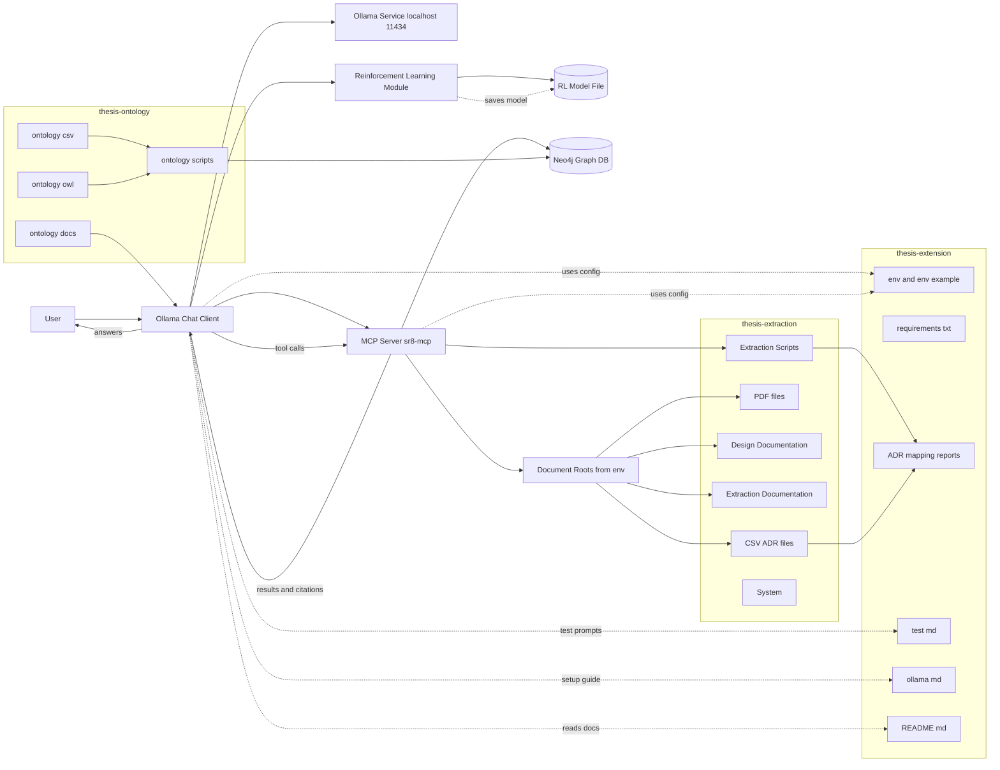

```mermaid
flowchart LR
    U[User] --> C[Ollama Chat Client]
    C --> O[Ollama Service localhost 11434]
    C --> M[MCP Server sr8-mcp]
    C --> RL[Reinforcement Learning Module]
    RL --> RLM[(RL Model File)]
    M --> N[(Neo4j Graph DB)]
    M --> DROOTS[Document Roots from env]

    subgraph EXT[thesis-extension]
        ENV[env and env example]
        REQ[requirements txt]
        REP[ADR mapping reports]
        TESTQ[test md]
        OMD[ollama md]
        RMD[README md]
    end

    C -. uses config .-> ENV
    M -. uses config .-> ENV
    C -. reads docs .-> RMD
    C -. setup guide .-> OMD
    C -. test prompts .-> TESTQ
    RL -. saves model .-> RLM

    subgraph EXTR[thesis-extraction]
        EXCSV[CSV ADR files]
        EXPDF[PDF files]
        EXDES[Design Documentation]
        EXDOC[Extraction Documentation]
        EXSCR[Extraction Scripts]
        EXSYS[System]
    end

    subgraph ONT[thesis-ontology]
        OWL[ontology owl]
        OCSV[ontology csv]
        ODOC[ontology docs]
        OSCR[ontology scripts]
    end

    DROOTS --> EXCSV
    DROOTS --> EXPDF
    DROOTS --> EXDES
    DROOTS --> EXDOC
    M --> EXSCR
    OSCR --> N
    OCSV --> OSCR
    OWL --> OSCR
    ODOC --> C
    EXSCR --> REP
    EXCSV --> REP
    C -->|tool calls| M
    M -->|results and citations| C
    C -->|answers| U
```